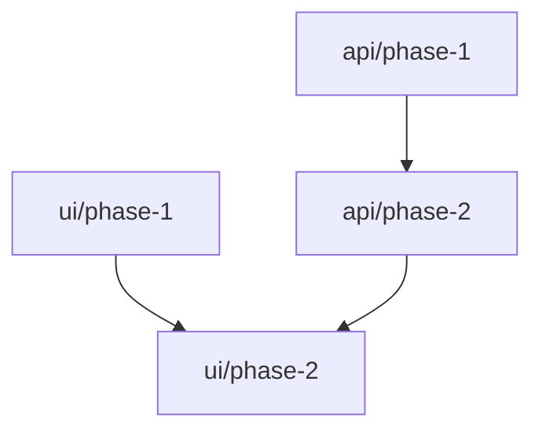

# Research: multi-project-specd

**Researched:** 2026-02-10
**Feature type:** Multi-project orchestrator for LLM-driven feature planning
**Confidence:** HIGH

## Summary

The multi-project orchestrator requires targeted modifications to 5 existing workflow files (map-codebase, new-feature, plan-feature, execute-plan, next-feature) with orchestrator-aware branching. The core pattern is simple: detect `"type": "orchestrator"` in `.specd/config.json` at workflow entry, branch to orchestrator flow or continue with existing single-project flow. Orchestrator flows delegate to existing per-project workflows — wrapping, not replacing.

External research confirms the approach aligns with established patterns from Nx (dependency declaration), GitHub Actions (phase sequencing via `needs`), and Pact (consumer/provider contracts). The markdown-first, zero-dependency constraint is well-served by these patterns since they're all representable in structured markdown.

The biggest risks are LLM-specific: context loss during delegation (41-86.7% failure rate in multi-agent systems), context window exhaustion in long features, and cascading replan failures. Mitigations are already partially addressed by existing decisions (DEC-001's explicit requirement passing, DEC-004's contract guardian, DEC-008's selective loading). Additional protections needed: cycle detection in dependency graphs, replan depth limits, and one-session-at-a-time guidance.

**Key recommendation:** Build orchestrator as a thin wrapper around existing workflows. Detect mode via config.json, branch to orchestrator logic that delegates to unchanged per-project workflows. New files are templates only — no runtime code changes needed.

---

## Codebase Integration

How this feature fits with existing code.

### Workflow Files Requiring Changes

| Workflow | Change Type | Scope |
|----------|------------|-------|
| `specdacular/workflows/map-codebase.md` | Add multi-project detection + orchestrator mapping flow | New steps after `check_existing_docs` |
| `specdacular/workflows/new-feature.md` | Add orchestrator detection + project routing + delegation | New steps after `validate` |
| `specdacular/workflows/plan-feature.md` | Add cross-project dependency tracking | New steps after `validate` |
| `specdacular/workflows/execute-plan.md` | Add contract validation after phase execution | New steps after `execute_tasks` |
| `specdacular/workflows/next-feature.md` | Add cross-project scheduling + optional project argument | New steps at `select_feature` |

### Patterns to Follow

**Orchestrator Detection (all workflows):**
```bash
# Standard detection — add at workflow entry
cat .specd/config.json 2>/dev/null | grep '"type".*"orchestrator"'
```
Branch to orchestrator flow if detected, otherwise continue existing flow unchanged.

**Agent Spawning (from map-codebase.md):**
```markdown
Task tool with subagent_type="specd-codebase-mapper", run_in_background=true
```
For orchestrator: spawn per-project mappers in parallel, then orchestrator mapper after all complete.

**Delegation (from next-feature.md):**
```markdown
Execute the research-feature workflow logic:
@~/.claude/specdacular/workflows/research-feature.md
After completion, loop back to read_state.
```
Orchestrator uses same pattern: delegate to existing workflows inline, loop back after.

**Argument Parsing (from prepare-phase.md):**
```
Split $ARGUMENTS: first word = feature-name, second word = phase/project
```
For orchestrator `next`: first word = feature-name, second word (optional) = project-name.

### File Locations

**New templates to create:**
```
specdacular/templates/orchestrator/
├── PROJECTS.md       # Project registry (name, path, tech stack, purpose)
├── TOPOLOGY.md       # Inter-project communication patterns
├── CONTRACTS.md      # Shared interface descriptions (loose)
├── CONCERNS.md       # Cross-cutting system-level gotchas
└── config.json       # Orchestrator config template
```

**New feature template:**
```
specdacular/templates/features/
└── DEPENDENCIES.md   # Cross-project phase dependency graph (orchestrator features only)
```

**No changes needed:**
- `bin/install.js` — existing `copyWithPathReplacement()` auto-handles new directories
- `commands/specd/*.md` — commands delegate to workflows, no changes needed
- `agents/specd-codebase-mapper.md` — reused as-is for per-project mapping
- All sub-project templates — unchanged per DEC-001

### Integration Points

| Connect To | Via | Purpose |
|------------|-----|---------|
| Existing workflows | `@~/.claude/specdacular/workflows/*.md` delegation | Reuse all per-project logic |
| config.json | `"type": "orchestrator"` field check | Mode detection |
| Sub-project `.specd/` | Standard file reads from orchestrator | State aggregation |
| Agent system | Task tool with `run_in_background` | Parallel per-project mapping |

---

## Implementation Approach

Patterns and formats adapted for this feature.

### Dependency Graph Format

**Pattern:** Nx-inspired `dependsOn` + GitHub Actions `needs` in structured markdown

**Why:** Proven patterns, readable by Claude, representable in markdown without external tools.

**DEPENDENCIES.md format:**
```markdown
# Dependencies: {feature-name}

## Project Involvement

| Project | Role | Path |
|---------|------|------|
| api | Authentication endpoints, token management | ./api |
| ui | Login page, session handling | ./ui |

## Phase Dependencies

| Phase | Depends On | Status |
|-------|------------|--------|
| api/phase-1 | — | pending |
| ui/phase-1 | — | pending |
| api/phase-2 | api/phase-1 | blocked |
| ui/phase-2 | api/phase-2, ui/phase-1 | blocked |

## Dependency Graph


```

**Key properties:**
- Table format is parseable by Claude for scheduling logic
- Mermaid graph renders in GitHub for visualization
- Status column updated as phases complete
- `next` command reads table to find unblocked phases

### Contract Format (System-Level)

**Pattern:** Pact-inspired consumer/provider relationships, kept loose per DEC-008

**CONTRACTS.md format (orchestrator codebase docs):**
```markdown
## API ↔ UI

**Communication:** REST over HTTP
**Pattern:** UI is the sole consumer of the API
**Shared domains:** Authentication, Users, Projects
**Source of truth:** API defines the contract, UI adapts

## API ↔ Worker

**Communication:** Redis pub/sub
**Pattern:** API publishes jobs, Worker consumes
**Shared domains:** Email notifications, Report generation
```

**Feature-level contracts (in orchestrator FEATURE.md):**
```markdown
### Cross-Project Contracts for This Feature

**API provides:**
- Login endpoint accepting email/password, returning tokens
- Token refresh endpoint

**UI consumes:**
- Login endpoint (form submission)
- Token refresh (automatic on 401)
```

### Orchestrator State Pattern

**Pattern:** Explicit state files per project + orchestrator aggregation

The orchestrator's `next` command aggregates state by:
1. Reading orchestrator DEPENDENCIES.md for the feature (dependency graph)
2. Reading each sub-project's `.specd/features/{name}/STATE.md` (per-project progress)
3. Computing unblocked phases from graph + status
4. Presenting dashboard with next recommended action

### Workflow Branching Architecture

**Pattern:** Additive branching — orchestrator steps are new branches, not modifications to existing steps

```
[existing step] → [orchestrator detection] → orchestrator flow
                                           → existing flow (unchanged)
```

Every workflow gains one detection step. If orchestrator detected, branch to new orchestrator-specific steps. If not, continue exactly as before.

---

## Pitfalls

What commonly goes wrong and how to prevent it.

### Critical

**Context Loss During Sub-Project Delegation**
- What goes wrong: When orchestrator delegates to sub-project, cross-project context vanishes. Sub-project agent makes choices that break other projects' contracts.
- Why it happens: Multi-agent LLM systems fail at 41-86.7% rates because hand-offs between agents lose shared context.
- Prevention: Pass all cross-project constraints as explicit technical requirements in sub-project FEATURE.md (DEC-001 already addresses this). Include contract expectations prominently.
- Detection: Sub-project implements correct feature but wrong interface; caught during orchestrator contract review (DEC-004).

**Circular Dependency Deadlock**
- What goes wrong: Project A phase 2 depends on Project B phase 2, which depends on Project A phase 2. `next` finds zero unblocked work.
- Why it happens: Dependency graphs not validated for cycles during planning.
- Prevention: Run topological sort on dependency graph during `plan-feature`. Fail and ask user to restructure if cycles detected.
- Detection: `next` command finds zero unblocked work despite incomplete phases.

**Context Window Exhaustion in Long Features**
- What goes wrong: Multi-project features with many phases accumulate context. Orchestrator loses information mid-workflow.
- Why it happens: Each orchestrator command needs sub-project states + dependency graph + contract history. Performance degrades with long contexts.
- Prevention: Store structured state in files (DEPENDENCIES.md, STATE.md), read selectively. Don't dump full history into context. Compare only current phase output against specific contract.
- Detection: Orchestrator forgets earlier decisions or fails to detect obvious contract violations.

**Cascading Replan Failures**
- What goes wrong: One contract deviation triggers replan in project B, which creates new deviation in project C, cascading through entire system.
- Why it happens: Cascading failures are amplified in multi-agent systems where each agent builds on potentially faulty foundations.
- Prevention: Batch deviations — collect all from a phase before triggering replans. Show full impact analysis. Limit replan depth: after 2 cascading replans, pause for user review.
- Detection: Multiple sequential replans from single change; CHANGELOG shows cascade pattern.

**Stale State Race Conditions**
- What goes wrong: User has two Claude Code sessions. One completes a phase while the other is working with stale dependency state.
- Why it happens: File-based state with no locking. Multiple sessions can read/write simultaneously.
- Prevention: Document "one active session at a time" for orchestrator mode. Re-read all STATE.md files before determining next action.
- Detection: Git conflicts in STATE.md files, phases executed in wrong order.

### Moderate

**Breaking Change Detection False Positives**
- What goes wrong: Orchestrator flags non-breaking changes (adding optional field) as deviations. User gets alert fatigue, ignores real breaks.
- Prevention: Feature-level contracts should distinguish required vs. optional. User can mark deviation as "accepted, update contract" vs "needs replan."

**Orchestrator Overhead for Simple Systems**
- What goes wrong: For 2 projects with simple features, orchestrator ceremony outweighs value.
- Prevention: Clear guidance on when orchestrator adds value (3+ projects with shared contracts). Allow single-project features even in orchestrator setup.

**Dependency Graph Becomes "The Knot"**
- What goes wrong: Cross-project dependencies grow into unmaintainable tangle.
- Prevention: Per-feature dependency graphs (not global). Regularly review TOPOLOGY.md for unnecessary coupling. Flag when every feature touches all projects.

### LLM-Specific Warnings

| When Implementing | Watch Out For | Prevention |
|-------------------|---------------|------------|
| Sub-project delegation | Context loss — agent forgets orchestrator constraints | Pass constraints as FEATURE.md requirements, not just context |
| Cross-project scheduling | Context rot — middle-of-context info lost | Load only relevant project states, not all history |
| Contract validation | Comparison quality degrades with context length | Compare specific contract sections, not full docs |
| Project switching | Warm-up cost — agent needs to reload project conventions | Batch operations by project, include project summary |
| Long feature execution | Accumulated context — early decisions forgotten | Summarize after each phase, rely on state files |

---

## Confidence Assessment

| Area | Level | Reason |
|------|-------|--------|
| Codebase integration | HIGH | All 5 workflows read and understood, branching points identified |
| Dependency graph format | HIGH | Nx and GitHub Actions patterns are proven, markdown-compatible |
| Contract format | MEDIUM | DEC-008 approach is sound but deviation detection is untested |
| LLM-specific pitfalls | HIGH | Multiple 2025 research papers confirm context loss and cascading failures |
| Installation impact | HIGH | Verified existing install.js handles new directories automatically |

---

## Open Questions

1. **Cycle detection in practice**
   - What we know: Topological sort catches cycles in static dependency graphs
   - What's unclear: Can cycles emerge during execution (phase deviations creating new dependencies)?
   - Recommendation: Validate graph during planning; re-validate after any replan

2. **Contract deviation granularity**
   - What we know: Feature-level contracts are more specific than system-level
   - What's unclear: How precisely should "deviation" be defined? Exact match vs semantic similarity?
   - Recommendation: Start with human review (orchestrator flags, user decides). Automate later.

3. **Orchestrator mapper scope**
   - What we know: It reads sub-project maps + scans codebases for system-level artifacts
   - What's unclear: What specific system-level artifacts to look for (docker-compose, CI configs, shared configs)?
   - Recommendation: Define list during template creation; iterate based on real usage

---

## Sources

### Codebase (from Explore)
- `specdacular/workflows/map-codebase.md` — Agent spawning pattern, parallel execution, verification
- `specdacular/workflows/new-feature.md` — Feature creation flow, template usage, commit pattern
- `specdacular/workflows/plan-feature.md` — Phase derivation, roadmap creation
- `specdacular/workflows/execute-plan.md` — Task execution, deviation handling, verification
- `specdacular/workflows/next-feature.md` — State machine, delegation pattern, argument parsing
- `bin/install.js` — Template installation, path replacement, no changes needed

### Verified External (HIGH confidence)
- [Nx Project Configuration](https://nx.dev/docs/reference/project-configuration) — `dependsOn`, `implicitDependencies` patterns
- [Turborepo Task Dependencies](https://turbo.build/repo/docs/core-concepts/monorepos/task-dependencies) — Caret syntax for dependency ordering
- [GitHub Actions Dependent Jobs](https://www.edwardthomson.com/blog/github_actions_17_dependent_jobs) — `needs` keyword for phase sequencing
- [Mermaid Syntax Reference](https://mermaid.js.org/intro/syntax-reference.html) — DAG visualization in markdown
- [Pact Contracts Documentation](https://docs.pactflow.io/docs/bi-directional-contract-testing/contracts/pact/) — Consumer/provider contract format

### Community (MEDIUM confidence)
- [Why Do Multi-Agent LLM Systems Fail? (arXiv 2025)](https://arxiv.org/html/2503.13657v1) — 41-86.7% failure rates, cascading failures
- [Context Window Problem (Factory.ai)](https://factory.ai/news/context-window-problem) — Context exhaustion in multi-agent workflows
- [Context Engineering for LLM Agents (Medium 2025)](https://medium.com/@kuldeep.paul08/context-engineering-optimizing-llm-memory-for-production-ai-agents-6a7c9165a431) — Context rot, selective loading
- [Circular Dependencies in Microservices (Substack)](https://systemdr.substack.com/p/how-circular-dependencies-kill-your) — Real-world deadlock examples
- [Seven Microservices Anti-patterns (InfoQ)](https://www.infoq.com/articles/seven-uservices-antipatterns/) — The Knot anti-pattern

### For Awareness Only (LOW confidence)
- General monorepo blog posts on coordination challenges
- API Blueprint markdown format (alternative contract approach)

---

## Decisions Made

Decisions recorded in DECISIONS.md during this research:

| Decision | Rationale |
|----------|-----------|
| DEC-009: Validate dependency graph for cycles during planning | Topological sort catches deadlocks before execution. Proven pattern from CI/CD tools. |
| DEC-010: Limit replan cascade depth to 2 | Research shows cascading failures amplify in multi-agent systems. Pause after 2 cascading replans for human review. |
| DEC-011: One active orchestrator session at a time | File-based state has no locking. Concurrent sessions cause stale state race conditions. |
