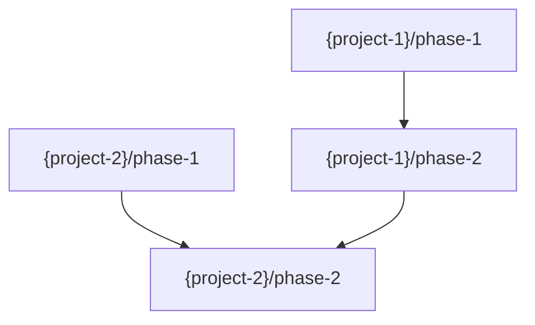

# Plan 02: Dependency Graph, Cycle Detection & Multi-Project Commit

## Objective

Add the cross-project dependency graph step (with DEPENDENCIES.md), topological sort cycle detection, and multi-project commit/completion to the plan-feature workflow.

## Context

**Reference these files:**
- `@specdacular/workflows/plan-feature.md` — Workflow being modified (already has orchestrator detection + phase derivation from Plan 01)
- `@.specd/features/multi-project-specd/plans/phase-04/CONTEXT.md` — Phase discussion resolutions
- `@specdacular/templates/features/DEPENDENCIES.md` — Cross-project dependency graph template

**Relevant Decisions:**
- DEC-002: Per-project roadmaps with orchestrator dependency tracking
- DEC-009: Validate dependency graph for cycles during planning

**From Phase Discussion:**
- Propose dependencies from CONTRACTS.md + project responsibilities
- User confirms/adjusts
- Write DEPENDENCIES.md using Phase 1 template
- Topological sort for cycle detection
- If cycles: show path, ask user to restructure
- Mermaid DAG visualization

---

## Tasks

### Task 1: Add build_dependency_graph step

**Files:** `specdacular/workflows/plan-feature.md`

**Action:**
Add `build_dependency_graph` step after `write_project_roadmaps`. This builds the cross-project phase dependency graph.

```markdown
<step name="build_dependency_graph">
Build cross-project phase dependency graph.

**Analyze cross-project dependencies:**
For each phase across all projects, determine:
- Does this phase produce outputs consumed by phases in other projects?
- Does this phase require outputs from phases in other projects?

Use these sources to infer dependencies:
- CONTRACTS.md — Which projects share interfaces? Phase that creates an interface must precede phase that consumes it.
- TOPOLOGY.md — Communication patterns indicate dependency direction.
- Per-project FEATURE.md — Integration points reveal cross-project needs.
- Per-project ROADMAP.md — Phase goals indicate what each phase produces.

**Build dependency table:**
```
| Phase | Depends On | Reason |
|-------|------------|--------|
| {project-1}/phase-1 | — | No cross-project deps |
| {project-2}/phase-1 | — | No cross-project deps |
| {project-1}/phase-2 | {project-2}/phase-1 | Needs {interface} from {project-2} |
| {project-2}/phase-2 | {project-1}/phase-2 | Consumes {output} from {project-1} |
```

**Present proposed dependencies:**
```
Here are the cross-project phase dependencies I've identified:

{dependency table}

Phases with no cross-project deps can start independently.
Phases with dependencies must wait for their prerequisites.
```

Use AskUserQuestion:
- header: "Dependencies"
- question: "Do these cross-project dependencies look right?"
- options:
  - "Yes, looks right" — Continue with these dependencies
  - "I need to adjust" — Modify dependencies

**If "I need to adjust":**
Ask user for specific changes. Apply adjustments.

Continue to validate_dependencies.
</step>
```

**Verify:**
```bash
grep -c "build_dependency_graph" specdacular/workflows/plan-feature.md
```
Should return at least 2.

**Done when:**
- [ ] `build_dependency_graph` step exists
- [ ] Infers dependencies from CONTRACTS.md, TOPOLOGY.md, project features
- [ ] Presents dependency table for user confirmation
- [ ] User can adjust dependencies

---

### Task 2: Add validate_dependencies step with cycle detection

**Files:** `specdacular/workflows/plan-feature.md`

**Action:**
Add `validate_dependencies` step that performs topological sort to detect cycles (DEC-009).

```markdown
<step name="validate_dependencies">
Validate the dependency graph has no cycles (DEC-009).

**Perform topological sort:**

Build a directed graph from the dependency table. For each phase node:
1. Calculate in-degree (number of dependencies)
2. Start with all nodes that have in-degree 0 (no dependencies)
3. Process each node: remove its edges, decrement in-degrees of dependent nodes
4. If any new nodes reach in-degree 0, add them to the queue
5. If all nodes are processed: graph is valid (no cycles)
6. If unprocessed nodes remain: cycle detected

**If no cycles:**
```
Dependency graph validated — no cycles detected.
{N} phases can start independently.
{M} phases have cross-project dependencies.
```

Continue to write_dependencies.

**If cycle detected:**
Identify the cycle path from the unprocessed nodes.

```
Cycle detected in cross-project dependencies:

{project-1}/phase-{X} → {project-2}/phase-{Y} → {project-1}/phase-{X}

This means these phases depend on each other, creating a deadlock.

To resolve:
- Split one of the phases so part can run earlier
- Remove one direction of the dependency
- Merge the dependent work into a single phase
```

Use AskUserQuestion:
- header: "Cycle"
- question: "How would you like to resolve this cycle?"
- options:
  - "I'll restructure" — Go back to adjust dependencies
  - "Split a phase" — Break a phase into sub-phases
  - "Help me decide" — Get a recommendation

**If "I'll restructure":** Return to build_dependency_graph.
**If "Split a phase":** Discuss which phase to split, update project roadmap, return to validate_dependencies.
**If "Help me decide":** Analyze the cycle and recommend the simplest resolution. Apply after user confirms.
</step>
```

**Verify:**
```bash
grep -c "validate_dependencies" specdacular/workflows/plan-feature.md
```
Should return at least 2.

**Done when:**
- [ ] `validate_dependencies` step exists
- [ ] Implements topological sort for cycle detection
- [ ] Shows clear cycle path when detected
- [ ] Offers resolution options
- [ ] Loops back if restructuring needed

---

### Task 3: Add write_dependencies, commit, and completion steps

**Files:** `specdacular/workflows/plan-feature.md`

**Action:**
Add the DEPENDENCIES.md writing step, multi-project commit, and completion summary.

**Step: write_dependencies**

```markdown
<step name="write_dependencies">
Write DEPENDENCIES.md in the orchestrator's feature folder.

**Write DEPENDENCIES.md:**
Use template at `~/.claude/specdacular/templates/features/DEPENDENCIES.md`

Fill in:
- **Project Involvement table:** Each project with its role, phase count, and feature path
- **Phase Dependencies table:** All cross-project dependencies with status (all "pending" initially)
- **Mermaid DAG:** Visual representation of the dependency graph



- **Scheduling Notes:** Which phases can start immediately, which are blocked

**Also update orchestrator STATE.md and config.json:**

Update STATE.md:
- Stage: discussion -> planned
- Add phases info (total phases across all projects)

Update config.json:
```json
{
  "stage": "planned",
  "phases": {
    "total": {sum of all project phases},
    "completed": 0,
    "current": 1
  }
}
```

Continue to orchestrator_plan_commit.
</step>
```

**Step: orchestrator_plan_commit**

```markdown
<step name="orchestrator_plan_commit">
Commit all roadmaps and dependency graph.

```bash
# Add orchestrator feature updates
git add .specd/features/{feature-name}/DEPENDENCIES.md
git add .specd/features/{feature-name}/STATE.md
git add .specd/features/{feature-name}/config.json

# Add per-project roadmaps, state, and phase directories
{For each project:}
git add {project-path}/.specd/features/{feature-name}/ROADMAP.md
git add {project-path}/.specd/features/{feature-name}/plans/
git add {project-path}/.specd/features/{feature-name}/STATE.md
git add {project-path}/.specd/features/{feature-name}/config.json

git commit -m "docs({feature-name}): create multi-project roadmap

Orchestrator:
- DEPENDENCIES.md: Cross-project phase dependency graph

Projects:
{For each project:}
- {project-name}: {N} phases — ROADMAP.md + phase directories

Co-Authored-By: Claude <noreply@anthropic.com>"
```

Continue to orchestrator_plan_completion.
</step>
```

**Step: orchestrator_plan_completion**

```markdown
<step name="orchestrator_plan_completion">
Present multi-project roadmap summary.

```
━━━━━━━━━━━━━━━━━━━━━━━━━━━━━━━━━━━━━━━━━━━━━━━━━━━━━━
 MULTI-PROJECT ROADMAP CREATED
━━━━━━━━━━━━━━━━━━━━━━━━━━━━━━━━━━━━━━━━━━━━━━━━━━━━━━

**Feature:** {feature-name}

## Per-Project Phases

{For each project:}
**{project-name}** ({N} phases):
  Phase 1: {Name} — {Goal}
  Phase 2: {Name} — {Goal}
  ...

## Cross-Project Dependencies

{dependency summary — which phases block which}
{N} independent phases, {M} dependent phases
No cycles detected.

## Files Created

- `.specd/features/{feature-name}/DEPENDENCIES.md` — Dependency graph
{For each project:}
- `{project-path}/.specd/features/{feature-name}/ROADMAP.md`
- `{project-path}/.specd/features/{feature-name}/plans/phase-{NN}/`

───────────────────────────────────────────────────────

## What's Next — Phase by Phase

The orchestrator will guide you through phases respecting cross-project dependencies.

/specd:feature:next {feature-name} — Start executing phases
```

End workflow.
</step>
```

Also update the `<success_criteria>` section to include multi-project criteria.

**Verify:**
```bash
for step in write_dependencies orchestrator_plan_commit orchestrator_plan_completion; do
  grep -q "$step" specdacular/workflows/plan-feature.md && echo "✓ $step" || echo "✗ $step MISSING"
done
```
All should return ✓.

**Done when:**
- [ ] `write_dependencies` writes DEPENDENCIES.md using Phase 1 template
- [ ] DEPENDENCIES.md includes dependency table + Mermaid DAG
- [ ] `orchestrator_plan_commit` commits all project roadmaps + dependencies
- [ ] `orchestrator_plan_completion` shows multi-project summary
- [ ] Success criteria updated for multi-project mode

---

## Verification

After all tasks complete:

```bash
# Verify all new steps exist
for step in orchestrator_derive_phases write_project_roadmaps build_dependency_graph validate_dependencies write_dependencies orchestrator_plan_commit orchestrator_plan_completion; do
  grep -q "$step" specdacular/workflows/plan-feature.md && echo "✓ $step" || echo "✗ $step MISSING"
done

# Verify existing steps still exist (no regression)
for step in validate load_context assess_readiness derive_phases write_roadmap create_directories update_state commit completion; do
  grep -q "$step" specdacular/workflows/plan-feature.md && echo "✓ $step (existing)" || echo "✗ $step MISSING (REGRESSION)"
done
```

**Plan is complete when:**
- [ ] All 7 new steps exist in the workflow
- [ ] All 9 existing steps still exist (no regression)
- [ ] Orchestrator flow: detect → derive phases → write roadmaps → build deps → validate → write deps → commit
- [ ] Cycle detection with resolution options
- [ ] Single-project flow unchanged

---

## Output

When this plan is complete:

1. Update `.specd/features/multi-project-specd/STATE.md`:
   - Mark both Phase 4 plans as complete
   - Mark Phase 4 as complete

2. Update `.specd/features/multi-project-specd/config.json`:
   - Increment completed phases to 4

3. Commit changes:
   ```bash
   git add specdacular/workflows/plan-feature.md
   git commit -m "feat(multi-project-specd): add dependency graph and cycle detection to plan-feature

   Plan phase-04/02 complete:
   - build_dependency_graph: cross-project phase dependencies
   - validate_dependencies: topological sort cycle detection (DEC-009)
   - write_dependencies: DEPENDENCIES.md with table + Mermaid DAG
   - orchestrator_plan_commit: multi-project commit
   - orchestrator_plan_completion: cross-project summary"
   ```

4. Phase 4 complete. Next: Phase 5 preparation.

---

## Implementation Log

During implementation, capture decisions and deviations to `.specd/features/multi-project-specd/CHANGELOG.md`.

---

## Notes

{Space for the implementing agent to record discoveries during implementation.}
