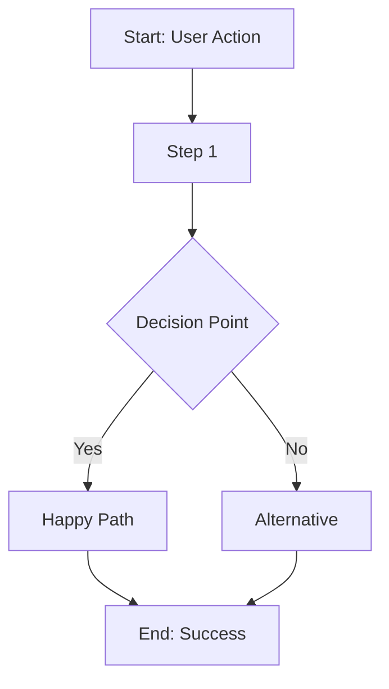
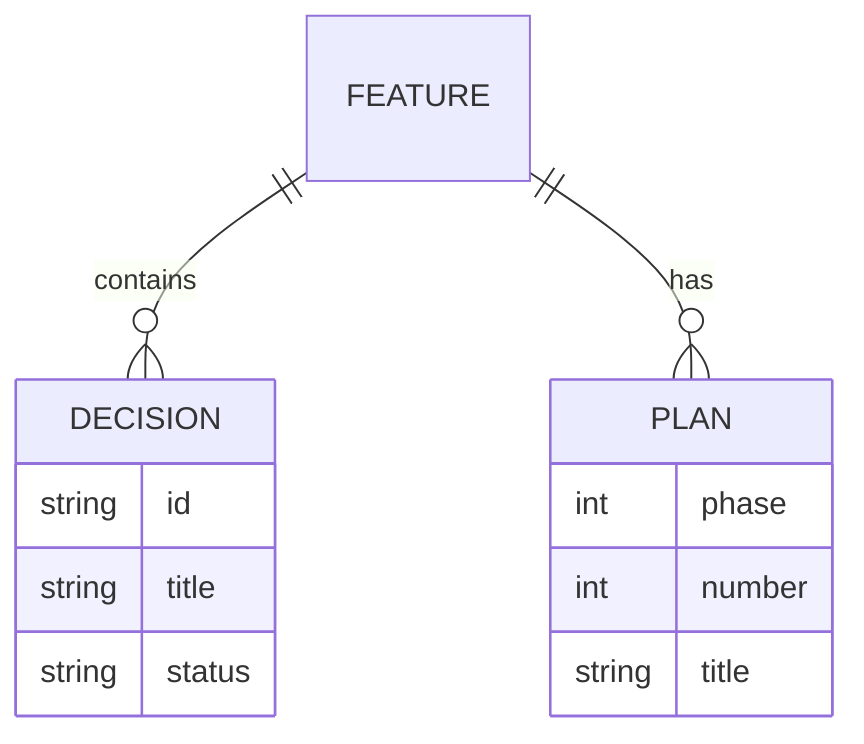

<!-- AUTO-GENERATED by bin/build-codex.js — DO NOT EDIT DIRECTLY -->
<!-- Source: Claude Code commands + workflows. Run: npm run build:codex -->

<purpose>
Generate Mermaid diagrams for a Specdacular feature blueprint.

Reads FEATURE.md, DECISIONS.md, and plans to understand the feature flow
and data relationships, then generates visual diagrams.

**Output:** `.specd/features/{name}/blueprint/diagrams.html`

**Invoked by:** `/specd:blueprint {feature} diagrams`
</purpose>

<philosophy>

## High-Level Understanding

Diagrams should help users understand the feature at a conceptual level.
Focus on the happy path and main flow, not every edge case.

## Two Diagram Types

1. **Flow Diagram** — Shows the process/workflow from start to end
2. **ER Diagram** — Shows data entities and relationships (if applicable)

## Keep It Simple

- Maximum 10-15 nodes per diagram
- Clear labels, no jargon
- Logical grouping with subgraphs if needed

</philosophy>

<process>

<step name="validate">
Check feature exists and main blueprint was generated.

```bash
# Check feature directory exists
[ -d ".specd/features/$FEATURE_NAME" ] || { echo "Feature not found"; exit 1; }

# Check blueprint exists (diagrams extend the blueprint)
[ -f ".specd/features/$FEATURE_NAME/blueprint/index.html" ] || { echo "Run /specd:blueprint $FEATURE_NAME first"; exit 1; }
```

**If blueprint not found:**
```
Blueprint not generated yet.

Run `/specd:blueprint {name}` first, then add diagrams.
```

Continue to load_context.
</step>

<step name="load_context">
Read feature files to understand flow and data relationships.

**Read with `cat -n`:**
- `.specd/features/{name}/FEATURE.md` — Feature purpose, components
- `.specd/features/{name}/DECISIONS.md` — Architectural decisions
- `.specd/features/{name}/CONTEXT.md` — Clarified requirements
- `.specd/features/{name}/plans/` — Execution plans (if exist)

**Extract:**
- Main user journey (from FEATURE.md)
- Key decision points (from DECISIONS.md)
- Data entities and relationships (from artifacts)
- Process steps (from plans)

Continue to generate_flow_diagram.
</step>

<step name="generate_flow_diagram">
Generate a Mermaid flowchart showing the feature's process flow.

**Analyze feature to identify:**
- Start point (user action or trigger)
- Main process steps
- Decision points (if/else branches)
- End point (success state)

**Mermaid flowchart syntax:**


**Guidelines:**
- Use `graph TD` (top-down) for process flows
- Use `graph LR` (left-right) for pipelines
- Keep to 10-15 nodes maximum
- Use clear, short labels
- Group related steps in subgraphs if needed

**Store flow diagram Mermaid code for later embedding.**

Continue to generate_er_diagram.
</step>

<step name="generate_er_diagram">
Generate a Mermaid ER diagram showing data relationships.

**Analyze feature to identify:**
- Main data entities (files, objects, records)
- Relationships between entities
- Key attributes of each entity

**Mermaid ER syntax:**


**Guidelines:**
- Only include entities relevant to understanding the feature
- Show cardinality: `||` (one), `o{` (many), `|o` (zero or one)
- Include 2-4 key attributes per entity
- Skip ER diagram if feature doesn't have meaningful data relationships

**Store ER diagram Mermaid code for later embedding.**

Continue to generate_html.
</step>

<step name="generate_html">
Generate the diagrams HTML page with embedded Mermaid.

**HTML template:**
```html
<!DOCTYPE html>
<html>
<head>
  <title>Diagrams: {feature-name}</title>
  <script src="https://cdn.jsdelivr.net/npm/mermaid@10.6.1/dist/mermaid.min.js"></script>
  <style>
    body { font-family: system-ui, sans-serif; background: #f5f5f5; margin: 0; padding: 20px; }
    .diagram-container { max-width: 1000px; margin: 0 auto; }
    .diagram-section { background: white; border: 1px solid #ddd; padding: 20px; margin-bottom: 20px; border-radius: 4px; }
    .diagram-section h2 { margin-top: 0; color: #333; border-bottom: 1px solid #eee; padding-bottom: 10px; }
    .mermaid { text-align: center; }
    .diagram-description { color: #666; font-size: 14px; margin-bottom: 15px; }
  </style>
</head>
<body>
  <div class="diagram-container">
    <h1>{feature-name} - Diagrams</h1>
    <p style="color: #666;">Generated {date}</p>

    <div class="diagram-section">
      <h2>Process Flow</h2>
      <p class="diagram-description">{flow-description}</p>
      <pre class="mermaid">
{flow-diagram-mermaid}
      </pre>
    </div>

    <div class="diagram-section">
      <h2>Data Relationships</h2>
      <p class="diagram-description">{er-description}</p>
      <pre class="mermaid">
{er-diagram-mermaid}
      </pre>
    </div>
  </div>

  <script>
    mermaid.initialize({
      startOnLoad: true,
      theme: 'default',
      securityLevel: 'loose'
    });
  </script>
</body>
</html>
```

**Replace placeholders:**
- `{feature-name}` — Feature name
- `{date}` — Current date (YYYY-MM-DD)
- `{flow-description}` — Brief description of what the flow shows
- `{flow-diagram-mermaid}` — Generated flow diagram code
- `{er-description}` — Brief description of data model
- `{er-diagram-mermaid}` — Generated ER diagram code

Continue to write_diagrams.
</step>

<step name="write_diagrams">
Write the diagrams HTML file.

**Write file:**
Use file writing to create `.specd/features/{name}/blueprint/diagrams.html`
with the generated HTML content.

Continue to update_blueprint.
</step>

<step name="update_blueprint">
Update the main blueprint to enable the diagrams tab.

**Read:** `.specd/features/{name}/blueprint/index.html`

**Find and update:**
- Change `class="tab-link disabled"` to `class="tab-link"` for diagrams tab
- Find `<section id="diagrams"` and update content:

```html
<section id="diagrams" class="tab-content">
  <h2>Diagrams</h2>
  <p>Visual diagrams showing feature flow and data relationships.</p>
  <iframe src="diagrams.html" style="width: 100%; height: 700px; border: 1px solid #ddd;"></iframe>
  <p><a href="diagrams.html" target="_blank">Open in new tab</a></p>
</section>
```

**Write updated blueprint.**

Continue to present_completion.
</step>

<step name="present_completion">
Present diagrams completion.

```
━━━━━━━━━━━━━━━━━━━━━━━━━━━━━━━━━━━━━━━━━━━━━━━━━━━━━
 DIAGRAMS GENERATED
━━━━━━━━━━━━━━━━━━━━━━━━━━━━━━━━━━━━━━━━━━━━━━━━━━━━━

**Feature:** {feature-name}

## Diagrams Created
- Flow Diagram: {brief description}
- ER Diagram: {brief description}

## Files
- Diagrams: `.specd/features/{name}/blueprint/diagrams.html`
- Blueprint updated: Diagrams tab now enabled

───────────────────────────────────────────────────────

**View:** Open blueprint in browser to see diagrams tab.

**Regenerate:** Run `/specd:blueprint {name} diagrams` again to update.
```

End workflow.
</step>

</process>

<success_criteria>
- [ ] Feature validated
- [ ] Flow diagram generated from feature artifacts
- [ ] ER diagram generated (if applicable)
- [ ] Diagrams HTML written with Mermaid.js
- [ ] Main blueprint updated with diagrams tab enabled
</success_criteria>
