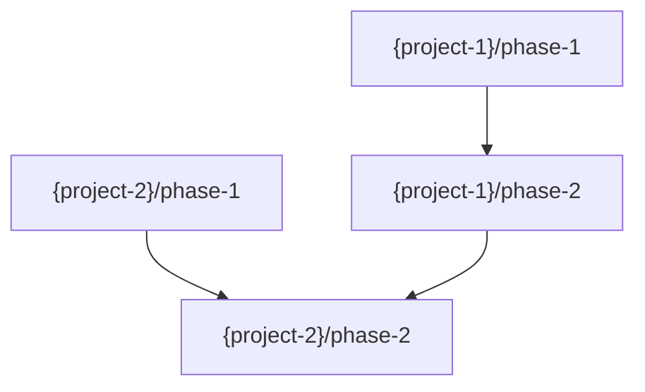

<!-- AUTO-GENERATED by bin/build-codex.js — DO NOT EDIT DIRECTLY -->
<!-- Source: Claude Code commands + workflows. Run: npm run build:codex -->

<purpose>
Create a roadmap with phase overview and empty phase directories. Detailed PLAN.md files are created later per-phase with `/specd:phase:plan`.

**Key principles:**
- Roadmap defines phases with goals, deliverables, and dependencies
- Phases follow natural code dependencies (types->API->UI)
- Empty phase directories are created as scaffolding
- No PLAN.md files — those are created just-in-time per phase

**Output:** ROADMAP.md + empty `plans/phase-XX/` directories
</purpose>

<philosophy>

## Roadmap, Not Plans

The roadmap defines WHAT each phase does and WHY it's ordered that way. The HOW (detailed plans) comes later, per phase, when context is freshest.

## Dependency-Driven Phases

Phases follow natural code dependencies:
1. **Types first** — Shared type definitions
2. **Data layer** — Database schemas, API routes
3. **Business logic** — Hooks, utilities, services
4. **UI** — Components that consume the above

Each phase's output is input for the next.

## Just-in-Time Detail

Creating detailed plans for all phases upfront means later plans go stale as earlier phases deviate. Instead:
1. Create the roadmap (this workflow)
2. For each phase: prepare -> plan -> execute
3. Each phase's plans use the latest context

</philosophy>

<process>

<step name="validate">
Validate feature exists and has required context.

```bash
# Check feature exists
[ -d ".specd/features/$ARGUMENTS" ] || { echo "not found"; exit 1; }

# Check required files
[ -f ".specd/features/$ARGUMENTS/FEATURE.md" ] || { echo "missing FEATURE.md"; exit 1; }
[ -f ".specd/features/$ARGUMENTS/CONTEXT.md" ] || { echo "missing CONTEXT.md"; exit 1; }
[ -f ".specd/features/$ARGUMENTS/DECISIONS.md" ] || { echo "missing DECISIONS.md"; exit 1; }

# Check optional files
[ -f ".specd/features/$ARGUMENTS/RESEARCH.md" ] && echo "has_research"
```

**If feature not found:**
```
Feature '{name}' not found.

Run /specd:feature:new {name} to create it.
```

**If missing required files:**
```
Feature '{name}' is missing required context for planning:
- {missing file}

Run /specd:feature:discuss {name} to build more context.
```

Continue to load_context.
</step>

<step name="load_context">
Load ALL context.

**Read feature context:**
- `FEATURE.md` — Technical requirements, files to create
- `CONTEXT.md` — Resolved gray areas, code patterns discussed
- `DECISIONS.md` — All active decisions
- `RESEARCH.md` — If exists, implementation patterns and pitfalls

**Read codebase context (if available):**
- `PATTERNS.md` — Code patterns to follow
- `STRUCTURE.md` — Where files go
- `MAP.md` — System overview, integration points

**Extract key information:**
- Files that must be created (from FEATURE.md)
- Integration points (from FEATURE.md)
- Patterns to follow (from CONTEXT.md, RESEARCH.md, codebase)
- Decisions that affect implementation
- Pitfalls to avoid (from RESEARCH.md)

**Check for orchestrator mode:**

Read feature's `config.json`. If `"orchestrator": true`:

Set mode = "orchestrator".

**Load orchestrator-level context:**
- Orchestrator FEATURE.md — System-level requirements, project responsibilities
- Orchestrator CONTEXT.md — Cross-project discussion, resolved questions
- Orchestrator DECISIONS.md — System-level decisions

**Load system-level codebase docs:**
- `.specd/codebase/PROJECTS.md` — Project registry
- `.specd/codebase/TOPOLOGY.md` — Communication patterns
- `.specd/codebase/CONTRACTS.md` — Shared interfaces

**Load sub-project feature context:**
From feature config.json `"projects"` array, for each project:
- Read `{project-path}/.specd/features/{feature-name}/FEATURE.md` — Project-specific requirements
- Read `{project-path}/.specd/codebase/MAP.md` — Project code overview (if exists)
- Read `{project-path}/.specd/codebase/PATTERNS.md` — Project patterns (if exists)

```
Orchestrator mode: {N} projects involved in this feature.
Loading cross-project context for phase derivation.
```

Continue to orchestrator_derive_phases.

**If not orchestrator:**
Set mode = "project".
Continue to assess_readiness.
</step>

<step name="orchestrator_derive_phases">
Derive phases for all involved projects in a single orchestrator pass.

**For each involved project, analyze:**
- Project's FEATURE.md requirements (what it must create)
- Project's codebase patterns (how code is organized)
- Cross-project dependencies (from CONTRACTS.md, TOPOLOGY.md)

**Derive per-project phases:**
Apply the same dependency-driven phasing as single-project mode, but for each project:
1. Types/interfaces needed by this project
2. Data layer changes
3. Business logic
4. UI components (if applicable)
5. Integration/wiring

Adjust per project — not all projects need all phases. A backend API project may have 3 phases while a UI project has 4.

**Consider cross-project ordering:**
- Which project phases produce outputs that other project phases consume?
- Which phases can run independently?
- Reference CONTRACTS.md for interface dependencies

**Present consolidated view:**
```
Here's the proposed phase structure across all projects:

**{project-1}** ({N} phases):
  Phase 1: {Name} — {Goal}
  Phase 2: {Name} — {Goal}
  ...

**{project-2}** ({N} phases):
  Phase 1: {Name} — {Goal}
  Phase 2: {Name} — {Goal}
  ...

**Cross-project dependencies (preliminary):**
- {project-1}/phase-1 → no cross-project deps
- {project-2}/phase-2 → after {project-1}/phase-2

Does this phasing make sense? Any adjustments?
```

Use ask_user_question:
- header: "Phases"
- question: "Does this phase structure look right?"
- options:
  - "Yes, looks good" — Continue with this structure
  - "I want to adjust" — Modify phases or ordering

**If "I want to adjust":**
Ask user for specific changes. Apply adjustments.

Continue to write_project_roadmaps.
</step>

<step name="write_project_roadmaps">
Write ROADMAP.md for each involved sub-project.

For each project:

**Write ROADMAP.md:**
Use template at `.codex/specdacular/templates/features/ROADMAP.md`

Fill in with project-specific phases:
- Overview table: total phases, current phase 1, not started
- Phase list with one-liners
- Phase details: goal, creates, modifies, success criteria, dependencies (within this project only)
- Execution order
- Key decisions affecting this project's roadmap

**IMPORTANT (DEC-001):** Sub-project ROADMAP.md must be self-contained. Dependencies listed are intra-project only. No references to other projects or cross-project phases.

**Create phase directories:**
```bash
{For each project:}
mkdir -p {project-path}/.specd/features/{feature-name}/plans/phase-01
mkdir -p {project-path}/.specd/features/{feature-name}/plans/phase-02
# ... for each phase
```

**Update sub-project STATE.md:**
- Stage: discussion -> planned
- Add phases info

**Update sub-project config.json:**
```json
{
  "stage": "planned",
  "phases": {
    "total": {N},
    "completed": 0,
    "current": 1
  }
}
```

After all projects processed, verify:
```bash
for project in {project-paths}; do
  echo "Checking $project..."
  ls "$project/.specd/features/{feature-name}/ROADMAP.md"
  ls "$project/.specd/features/{feature-name}/plans/"
done
```

Continue to build_dependency_graph.
</step>

<step name="build_dependency_graph">
Build cross-project phase dependency graph.

**Analyze cross-project dependencies:**
For each phase across all projects, determine:
- Does this phase produce outputs consumed by phases in other projects?
- Does this phase require outputs from phases in other projects?

Use these sources to infer dependencies:
- CONTRACTS.md — Which projects share interfaces? Phase that creates an interface must precede phase that consumes it.
- TOPOLOGY.md — Communication patterns indicate dependency direction.
- Per-project FEATURE.md — Integration points reveal cross-project needs.
- Per-project ROADMAP.md — Phase goals indicate what each phase produces.

**Build dependency table:**
```
| Phase | Depends On | Reason |
|-------|------------|--------|
| {project-1}/phase-1 | — | No cross-project deps |
| {project-2}/phase-1 | — | No cross-project deps |
| {project-1}/phase-2 | {project-2}/phase-1 | Needs {interface} from {project-2} |
| {project-2}/phase-2 | {project-1}/phase-2 | Consumes {output} from {project-1} |
```

**Present proposed dependencies:**
```
Here are the cross-project phase dependencies I've identified:

{dependency table}

Phases with no cross-project deps can start independently.
Phases with dependencies must wait for their prerequisites.
```

Use ask_user_question:
- header: "Dependencies"
- question: "Do these cross-project dependencies look right?"
- options:
  - "Yes, looks right" — Continue with these dependencies
  - "I need to adjust" — Modify dependencies

**If "I need to adjust":**
Ask user for specific changes. Apply adjustments.

Continue to validate_dependencies.
</step>

<step name="validate_dependencies">
Validate the dependency graph has no cycles (DEC-009).

**Perform topological sort:**

Build a directed graph from the dependency table. For each phase node:
1. Calculate in-degree (number of dependencies)
2. Start with all nodes that have in-degree 0 (no dependencies)
3. Process each node: remove its edges, decrement in-degrees of dependent nodes
4. If any new nodes reach in-degree 0, add them to the queue
5. If all nodes are processed: graph is valid (no cycles)
6. If unprocessed nodes remain: cycle detected

**If no cycles:**
```
Dependency graph validated — no cycles detected.
{N} phases can start independently.
{M} phases have cross-project dependencies.
```

Continue to write_dependencies.

**If cycle detected:**
Identify the cycle path from the unprocessed nodes.

```
Cycle detected in cross-project dependencies:

{project-1}/phase-{X} → {project-2}/phase-{Y} → {project-1}/phase-{X}

This means these phases depend on each other, creating a deadlock.

To resolve:
- Split one of the phases so part can run earlier
- Remove one direction of the dependency
- Merge the dependent work into a single phase
```

Use ask_user_question:
- header: "Cycle"
- question: "How would you like to resolve this cycle?"
- options:
  - "I'll restructure" — Go back to adjust dependencies
  - "Split a phase" — Break a phase into sub-phases
  - "Help me decide" — Get a recommendation

**If "I'll restructure":** Return to build_dependency_graph.
**If "Split a phase":** Discuss which phase to split, update project roadmap, return to validate_dependencies.
**If "Help me decide":** Analyze the cycle and recommend the simplest resolution. Apply after user confirms.
</step>

<step name="write_dependencies">
Write DEPENDENCIES.md in the orchestrator's feature folder.

**Write DEPENDENCIES.md:**
Use template at `.codex/specdacular/templates/features/DEPENDENCIES.md`

Fill in:
- **Project Involvement table:** Each project with its role, phase count, and feature path
- **Phase Dependencies table:** All cross-project dependencies with status (all "pending" initially)
- **Mermaid DAG:** Visual representation of the dependency graph



- **Scheduling Notes:** Which phases can start immediately, which are blocked

**Also update orchestrator STATE.md and config.json:**

Update STATE.md:
- Stage: discussion -> planned
- Add phases info (total phases across all projects)

Update config.json:
```json
{
  "stage": "planned",
  "phases": {
    "total": {sum of all project phases},
    "completed": 0,
    "current": 1
  }
}
```

Continue to orchestrator_plan_commit.
</step>

<step name="orchestrator_plan_commit">
Commit all roadmaps and dependency graph.

```bash
# Add orchestrator feature updates
git add .specd/features/{feature-name}/DEPENDENCIES.md
git add .specd/features/{feature-name}/STATE.md
git add .specd/features/{feature-name}/config.json

# Add per-project roadmaps, state, and phase directories
{For each project:}
git add {project-path}/.specd/features/{feature-name}/ROADMAP.md
git add {project-path}/.specd/features/{feature-name}/plans/
git add {project-path}/.specd/features/{feature-name}/STATE.md
git add {project-path}/.specd/features/{feature-name}/config.json

git commit -m "docs({feature-name}): create multi-project roadmap

Orchestrator:
- DEPENDENCIES.md: Cross-project phase dependency graph

Projects:
{For each project:}
- {project-name}: {N} phases — ROADMAP.md + phase directories

Co-Authored-By: Claude <noreply@anthropic.com>"
```

Continue to orchestrator_plan_completion.
</step>

<step name="orchestrator_plan_completion">
Present multi-project roadmap summary.

```
━━━━━━━━━━━━━━━━━━━━━━━━━━━━━━━━━━━━━━━━━━━━━━━━━━━━━━
 MULTI-PROJECT ROADMAP CREATED
━━━━━━━━━━━━━━━━━━━━━━━━━━━━━━━━━━━━━━━━━━━━━━━━━━━━━━

**Feature:** {feature-name}

## Per-Project Phases

{For each project:}
**{project-name}** ({N} phases):
  Phase 1: {Name} — {Goal}
  Phase 2: {Name} — {Goal}
  ...

## Cross-Project Dependencies

{dependency summary — which phases block which}
{N} independent phases, {M} dependent phases
No cycles detected.

## Files Created

- `.specd/features/{feature-name}/DEPENDENCIES.md` — Dependency graph
{For each project:}
- `{project-path}/.specd/features/{feature-name}/ROADMAP.md`
- `{project-path}/.specd/features/{feature-name}/plans/phase-{NN}/`

───────────────────────────────────────────────────────

## What's Next — Phase by Phase

The orchestrator will guide you through phases respecting cross-project dependencies.

/specd:feature:continue {feature-name} — Start executing phases
```

End workflow.
</step>

<step name="assess_readiness">
Check if there's enough context to create a good roadmap.

**Required for planning:**
- [ ] Clear list of files to create
- [ ] Integration points identified
- [ ] Key decisions made (at least technology choices)

**Warning signs (insufficient context):**
- FEATURE.md has placeholder text
- CONTEXT.md has many unresolved gray areas
- No decisions in DECISIONS.md
- Major technical questions unanswered

**If insufficient:**
```
Feature '{name}' might benefit from more discussion before planning.

**Current state:**
- Files to create: {count or "unclear"}
- Integration points: {count or "unclear"}
- Decisions made: {count}
- Gray areas remaining: {count}

**Recommendation:**
/specd:feature:discuss {name} — Resolve remaining gray areas
/specd:feature:research {name} — Research implementation approach

Continue anyway? (Roadmap may need revision)
```

Use ask_user_question:
- header: "Plan Readiness"
- question: "How would you like to proceed?"
- options:
  - "Continue planning" — Create roadmap with current context
  - "Discuss first" — Run feature:discuss
  - "Research first" — Run feature:research

**If sufficient or user chooses to continue:**
Continue to derive_phases.
</step>

<step name="derive_phases">
Derive phases from dependency analysis.

**Analyze dependencies:**
1. What types/interfaces are needed? (Phase: Types)
2. What data layer changes are needed? (Phase: Data/API)
3. What business logic is needed? (Phase: Logic/Hooks)
4. What UI is needed? (Phase: Components)
5. What integration/wiring is needed? (Phase: Integration)

**Standard phase pattern:**
```
Phase 1: Foundation (types, schemas)
Phase 2: Data Layer (API routes, database)
Phase 3: Business Logic (hooks, services)
Phase 4: UI (components)
Phase 5: Integration (wiring, entry points)
```

**Adjust based on feature:**
- Small feature: might be 2-3 phases
- Large feature: might be 5+ phases
- Some features skip phases (no UI, no API, etc.)

**For each phase, identify:**
- Goal: What this phase achieves
- Creates: New files
- Modifies: Existing files
- Depends on: Previous phases or external dependencies

**Present to user:**
```
Based on the requirements, here's the proposed phase structure:

**Phase 1: {Name}** — {Goal}
Creates: {file list}
Depends on: None

**Phase 2: {Name}** — {Goal}
Creates: {file list}
Depends on: Phase 1

...

Does this phasing make sense? Any adjustments?
```

Continue to write_roadmap.
</step>

<step name="write_roadmap">
Write ROADMAP.md with phase overview.

**Use template at `.codex/specdacular/templates/features/ROADMAP.md`**

**Fill in:**

**Overview table:**
- Total phases
- Current phase: 1
- Status: Not Started

**Phase list:** Quick overview with one-liners

**Phase details:** For each phase:
- Goal
- Creates (file list)
- Modifies (file list)
- Success criteria
- Dependencies

**Execution order:** Visual representation

**Key decisions affecting roadmap:**
Reference decisions from DECISIONS.md that affect phase ordering

Continue to create_directories.
</step>

<step name="create_directories">
Create empty phase directories.

```bash
mkdir -p .specd/features/{feature-name}/plans/phase-01
mkdir -p .specd/features/{feature-name}/plans/phase-02
# ... for each phase
```

Continue to update_state.
</step>

<step name="update_state">
Update STATE.md with planning status.

**Update STATE.md:**
- Stage: discussion -> planned
- Roadmap created: yes
- Add planning session to history

**Update config.json:**
```json
{
  "stage": "planned",
  "phases": {
    "total": {N},
    "completed": 0,
    "current": 1
  }
}
```

Continue to commit.
</step>

<step name="commit">
Commit the roadmap.

[commit-docs.md](references/commit-docs.md)

- **$FILES:** `.specd/features/{feature-name}/ROADMAP.md .specd/features/{feature-name}/plans/ .specd/features/{feature-name}/STATE.md .specd/features/{feature-name}/config.json`
- **$MESSAGE:** `docs({feature-name}): create roadmap` with phase count and structure
- **$LABEL:** `roadmap creation`

Continue to completion.
</step>

<step name="completion">
Present what was created and how to proceed.

```
━━━━━━━━━━━━━━━━━━━━━━━━━━━━━━━━━━━━━━━━━━━━━━━━━━━━━
 ROADMAP CREATED
━━━━━━━━━━━━━━━━━━━━━━━━━━━━━━━━━━━━━━━━━━━━━━━━━━━━━━

**Feature:** {feature-name}

## Phases

**Phase 1:** {Name} — {Goal}
**Phase 2:** {Name} — {Goal}
...

## Files Created

- `.specd/features/{feature-name}/ROADMAP.md`
- `.specd/features/{feature-name}/plans/phase-01/`
- `.specd/features/{feature-name}/plans/phase-02/`
...

───────────────────────────────────────────────────────

## What's Next — Phase by Phase

For each phase, the flow is:

1. `/specd:phase:prepare {feature} {N}` — Discuss gray areas + optional research
2. `/specd:phase:plan {feature} {N}` — Create detailed task plans
3. `/specd:phase:execute {feature}` — Execute with progress tracking

**Start with Phase 1:**

/specd:phase:prepare {feature} 1 — Prepare the first phase

<sub>/clear first — fresh context window</sub>
```

End workflow.
</step>

</process>

<success_criteria>

## Single-Project Mode
- Feature validated with sufficient context
- All context loaded and analyzed
- Phases derived from dependency analysis
- ROADMAP.md provides clear phase overview
- Empty phase directories created
- No PLAN.md files created
- STATE.md updated to "planned" stage
- Committed to git
- User knows the per-phase flow: prepare -> plan -> execute

## Multi-Project Mode (Orchestrator)
- Orchestrator mode detected from feature config.json
- System-level and sub-project context loaded
- Per-project phases derived in single orchestrator pass
- User confirms/adjusts consolidated phase view
- Per-project ROADMAP.md files self-contained (DEC-001)
- Cross-project dependency graph built and confirmed by user
- Topological sort validates no cycles (DEC-009)
- DEPENDENCIES.md written with table + Mermaid DAG
- All roadmaps, state, and config committed
- User knows to use /specd:feature:continue for execution

</success_criteria>
