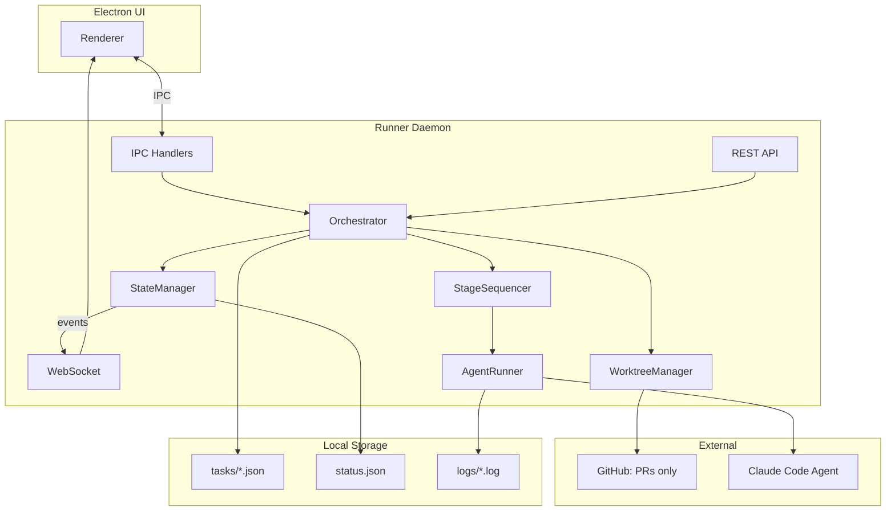
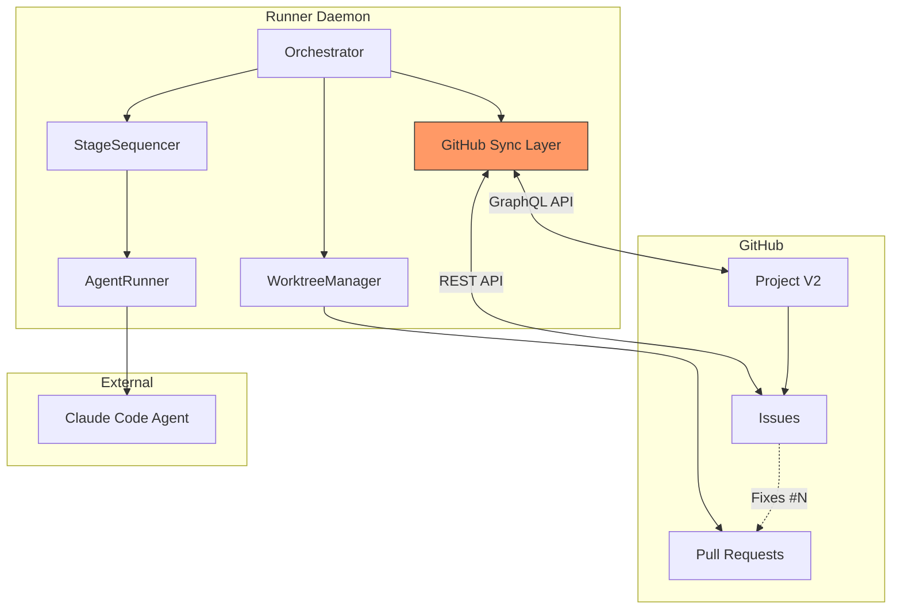
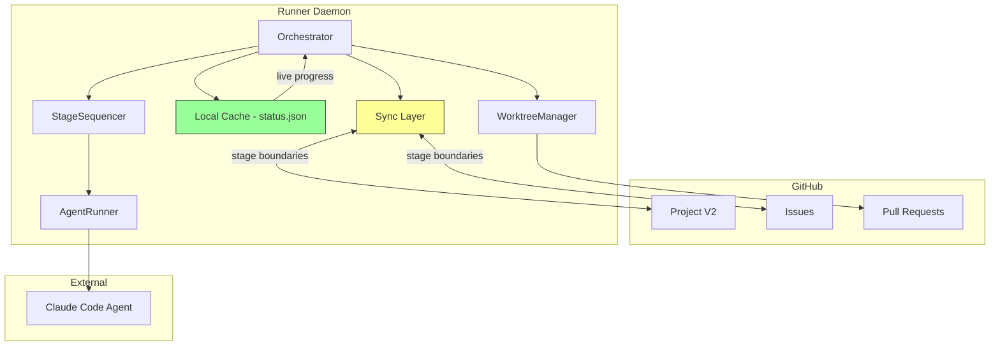
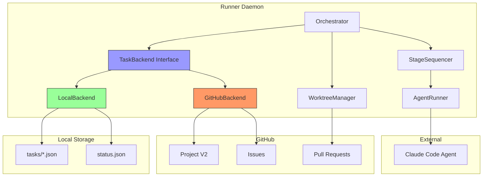

# GitHub Project Integration Research

> Research-only deliverable. No production code — only docs, diagrams, and interactive HTML playground files for visual comparison.

## Purpose

Evaluate replacing Specdacular's local state management (`~/.config/specd/projects/{id}/tasks/*.json`, `status.json`) with GitHub Projects V2 + Issues as the backing store. The current runner would become a **middleman harness** — orchestrating agent execution while delegating state persistence to GitHub.

This research produces:
1. A comparison document (this file)
2. Interactive HTML playground files for visualizing the architectural differences
3. Data flow diagrams in Mermaid

---

## Current Architecture: Local State

### How State Works Today

```
Orchestrator
  ├── TaskStore: ~/.config/specd/projects/{projectId}/tasks/{taskId}.json
  ├── StateManager: ~/.config/specd/projects/{projectId}/status.json (live progress)
  ├── WorktreeManager: git worktrees + gh CLI for PRs
  └── API/WebSocket: REST + WS for Electron UI sync
```

**Task JSON schema (local):**
```json
{
  "id": "idea-abc123",
  "name": "Feature name",
  "description": "What to build",
  "project_id": "8-char-uuid",
  "status": "idea|planning|review|ready|in_progress|done|failed",
  "priority": 10,
  "depends_on": ["other-task-id"],
  "spec": "Full specification text",
  "feedback": "User feedback for re-planning",
  "auto_execute": false,
  "pr_url": "https://github.com/...",
  "pipeline": "default|brainstorm",
  "last_pipeline": "brainstorm",
  "failed_pipeline": null,
  "completed_stages": [],
  "created_at": "2026-04-04T..."
}
```

**StateManager (live, in-memory + persisted):**
```json
{
  "started_at": "2026-04-04T...",
  "tasks": {
    "task-123": {
      "name": "Feature",
      "status": "running",
      "current_stage": "implement",
      "pipeline": "default",
      "pr_url": "...",
      "stages": [{
        "stage": "plan",
        "agent": "claude-superpower-planner",
        "status": "success",
        "started_at": "...",
        "duration": 123,
        "summary": "...",
        "live_progress": "writing code",
        "last_output_at": "..."
      }]
    }
  }
}
```

### Local State Strengths
- **Zero latency**: File reads/writes are instant
- **Offline capable**: No network dependency
- **Arbitrary data**: Any JSON structure, unlimited field complexity
- **Atomic within process**: Single writer (orchestrator) prevents conflicts
- **Live progress**: `live_progress` and `last_output_at` update every few seconds during agent runs
- **Resume from checkpoint**: `completed_stages` array enables skip-on-restart
- **Full control**: No API quotas, no rate limits, no authentication

### Local State Weaknesses
- **No built-in UI**: Requires custom Electron/web UI to visualize
- **Single machine**: State doesn't sync across devices
- **No collaboration**: Only the machine running the daemon sees state
- **No audit trail**: State overwrites (no history without git)
- **Manual backups**: State files can be lost if not backed up

---

## GitHub Projects V2: Capabilities

### Data Model

```
GitHub Project V2
  ├── Items (linked to Issues or Draft Issues)
  │   ├── Built-in fields: Title, Assignees, Labels, Milestone, Repository
  │   ├── Status field (Single Select): Idea | Planning | Review | Ready | In Progress | Done | Failed
  │   ├── Priority field (Single Select or Number)
  │   ├── Custom fields: Text, Number, Date, Single Select, Iteration
  │   └── Linked PRs (automatic when PR references issue)
  ├── Views
  │   ├── Board (Kanban by Status)
  │   ├── Table (spreadsheet-like)
  │   └── Roadmap (timeline)
  └── Workflows (Auto-add, Auto-archive, Auto-close, Status-on-event)
```

### API Surface

**GraphQL mutations for task management:**
- `addProjectV2ItemById` — add issue to project
- `addProjectV2DraftIssue` — add draft item (no backing issue)
- `updateProjectV2ItemFieldValue` — update one field (status, priority, custom)
- `archiveProjectV2Item` — archive completed items
- `deleteProjectV2Item` — remove from project

**Issue operations (REST or GraphQL):**
- Create/update/close issues
- Add comments (stage progress, agent logs)
- Link to PRs via "Fixes #N" syntax
- Labels for categorization

**CLI equivalents:**
```bash
# Create project
gh project create --title "Specd Tasks" --owner @me

# Add custom fields
gh project field-create 1 --owner @me --name "Pipeline" --data-type "SINGLE_SELECT" --single-select-options "brainstorm,default,custom"
gh project field-create 1 --owner @me --name "Spec" --data-type "TEXT"

# Create issue + add to project
gh issue create --title "Feature X" --body "spec here" --project "Specd Tasks"

# Update status
gh project item-edit --id ITEM_ID --field-id FIELD_ID --project-id PROJECT_ID --single-select-option-id OPTION_ID
```

### GitHub Projects Strengths
- **Free Kanban board**: No UI to build — GitHub provides board/table/roadmap views
- **Collaboration**: Multiple people see task state, can comment, assign
- **Audit trail**: Every change is recorded in issue/project history
- **PR integration**: Issues auto-link to PRs, auto-close on merge
- **Cross-device**: Accessible from any device with GitHub access
- **Webhooks**: Real-time notifications on state changes
- **Existing ecosystem**: GitHub Actions, bots, integrations

### GitHub Projects Limitations
- **No arbitrary data**: Limited to text, number, date, single-select fields
- **ID-heavy workflow**: Every mutation needs opaque node IDs (projectId, fieldId, optionId)
- **No live progress**: Can't store `live_progress` updates efficiently (would need issue comment spam)
- **Rate limited**: 5,000 GraphQL points/hour (sufficient for normal use, but burst-sensitive)
- **Latency**: 200-600ms per API call; multi-field updates need multiple calls
- **No offline**: Requires network for every operation
- **Views are read-only via API**: Can't programmatically create/manage board views
- **Workflow creation is UI-only**: Can toggle enabled/disabled, but can't create new automation rules
- **No transactional updates**: Updating 5 fields = 5 API calls; partial failures possible
- **Spec storage**: Issue body has a size limit (~65,536 chars); large specs may need file attachment or truncation
- **Completed stages**: No native array/JSON field type; would need text field with serialized JSON or issue comments

---

## Three Approaches

### Approach A: Full GitHub (Replace Local State)

**All state lives in GitHub.** Local files are eliminated. The runner queries GitHub for task state and writes results back.

```
Orchestrator (middleman)
  ├── Read tasks: gh api graphql → ProjectV2 items
  ├── Update status: gh project item-edit
  ├── Store spec: Issue body
  ├── Store progress: Issue comments
  ├── Store completed stages: Issue comment (JSON block)
  └── WorktreeManager: unchanged (git worktrees + PRs)
```

**Mapping current fields to GitHub:**

| Local Field | GitHub Storage | Fidelity |
|---|---|---|
| `id` | Issue number + item node ID | Full |
| `name` | Issue title | Full |
| `description` | Issue body (first section) | Full |
| `status` | Project Status field (Single Select) | Full |
| `priority` | Project Priority field (Number) | Full |
| `depends_on` | Task list in parent issue OR custom text field | Partial |
| `spec` | Issue body (main content) | Size-limited (~65K chars) |
| `feedback` | Issue comment thread | Full (better — threaded) |
| `auto_execute` | Project custom field (Single Select: Yes/No) | Full |
| `pr_url` | Linked PR (automatic) | Full (better — native) |
| `pipeline` | Project custom field (Single Select) | Full |
| `completed_stages` | Issue comment with JSON code block | Awkward |
| `live_progress` | NOT FEASIBLE at current update rate | Lost |
| `last_output_at` | NOT FEASIBLE | Lost |

**Trade-offs:**
- (+) No local state to manage, sync, or lose
- (+) Free Kanban UI, collaboration, audit trail
- (+) PR linking is native
- (-) **Loses live progress** — can't spam GitHub API every 2s
- (-) 200-600ms latency per state read/write
- (-) Completed stages serialization is awkward
- (-) Offline = dead
- (-) Complex ID resolution workflow for every mutation

### Approach B: Hybrid (GitHub as Source of Truth + Local Cache)

**GitHub Projects is the canonical state store.** Local `status.json` serves as a write-through cache for live progress and fast reads. Sync happens at stage boundaries.

```
Orchestrator (middleman harness)
  ├── Local cache: status.json (live progress, completed stages)
  ├── GitHub sync layer:
  │   ├── On task create → create GitHub issue + add to project
  │   ├── On status change → update project item status field
  │   ├── On stage complete → update issue comment with stages JSON
  │   ├── On live progress → LOCAL ONLY (not synced to GitHub)
  │   └── On PR create → link PR to issue (auto via "Fixes #N")
  ├── Reads: local cache first, GitHub fallback
  └── WorktreeManager: unchanged
```

**Trade-offs:**
- (+) Best of both worlds: fast local reads + GitHub persistence
- (+) Live progress works (local only)
- (+) Offline-capable for reads and in-progress work
- (+) GitHub UI available for overview and collaboration
- (-) Two sources of truth — sync conflicts possible
- (-) More complexity than either pure approach
- (-) Must handle sync failures gracefully

### Approach C: Pluggable Backend (Interface Abstraction)

**Define a `TaskBackend` interface.** Implement `LocalBackend` (current behavior) and `GitHubBackend`. The runner doesn't care which is active — configured per project.

```typescript
interface TaskBackend {
  // Task CRUD
  createTask(task: Task): Promise<Task>
  getTask(taskId: string): Promise<Task | null>
  getTasks(): Promise<Task[]>
  updateTask(taskId: string, updates: Partial<Task>): Promise<Task>
  deleteTask(taskId: string): Promise<void>

  // Live progress (may be no-op for GitHub)
  updateLiveProgress(taskId: string, progress: LiveProgress): void
  getCompletedStages(taskId: string): Promise<CompletedStage[]>

  // Lifecycle
  init(projectConfig: ProjectConfig): Promise<void>
  dispose(): Promise<void>
}
```

**Configuration:**
```json
{
  "backend": "local",
  "github": {
    "project_number": 1,
    "owner": "victorbalan"
  }
}
```

**Trade-offs:**
- (+) Maximum flexibility — swap backends per project
- (+) Clean separation of concerns
- (+) Can test both approaches independently
- (+) Future backends possible (Linear, Jira, etc.)
- (-) Abstraction cost — must find lowest common denominator
- (-) GitHub backend loses live progress (interface must accommodate)
- (-) More code to maintain
- (-) Risk of leaky abstraction

---

## Recommendation

**Approach C (Pluggable Backend)** is the strongest long-term choice, but this is a research deliverable — we're not building it yet. The research and playground files should:

1. **Compare all three approaches** visually in interactive HTML
2. **Map every current data field** to its GitHub equivalent (or note the gap)
3. **Show data flow diagrams** for each approach
4. **Prototype the `gh` CLI commands** needed for the GitHub backend
5. **Quantify the trade-offs** (latency, capability gaps, complexity)

---

## Deliverables Specification

### 1. Comparison Playground (`playground/github-integration/comparison.html`)

Interactive HTML file showing side-by-side comparison:

**Left panel: Local State Architecture**
- Visual representation of file system layout
- Data flow arrows showing read/write paths
- Task lifecycle state machine diagram
- Color-coded capability indicators

**Right panel: GitHub Projects Architecture**
- Visual representation of GitHub entities (Project, Issues, Fields)
- API call flow arrows
- Equivalent state machine (with gaps highlighted)
- Capability indicators (matching/missing)

**Interactive elements:**
- Click on a task lifecycle stage to see the operations needed for each approach
- Toggle between Approach A/B/C to see how the architecture changes
- Hover over data fields to see mapping details

### 2. Data Flow Playground (`playground/github-integration/data-flow.html`)

Animated data flow visualization:

**Scenarios to visualize:**
1. **Create a task** — local file write vs. GraphQL mutation chain
2. **Update status** — single file write vs. field-id lookup + mutation
3. **Live progress** — in-memory update vs. not feasible
4. **Resume from checkpoint** — read completed_stages vs. parse issue comments
5. **Stage completion** — file write + PR push vs. issue comment + field update + PR link

Each scenario shows:
- Steps required (numbered)
- Latency per step
- API calls needed
- Data payloads

### 3. Architecture Playground (`playground/github-integration/architecture.html`)

Three-tab layout showing the architecture for each approach:

**Tab A: Full GitHub**
- Orchestrator as thin wrapper around `gh` CLI
- All state reads/writes go through GitHub API
- Highlighted gaps (live progress, offline)

**Tab B: Hybrid**
- Local cache layer with sync arrows to GitHub
- Sync points marked (stage boundaries)
- Conflict resolution flow

**Tab C: Pluggable Backend**
- Interface layer between orchestrator and backends
- Two implementation boxes (Local, GitHub)
- Configuration routing

### 4. CLI Commands Reference (`playground/github-integration/cli-commands.html`)

Interactive reference showing the exact `gh` commands needed for each operation:

| Operation | Local (current) | GitHub CLI equivalent |
|---|---|---|
| Create task | `writeFileSync(taskPath, JSON.stringify(task))` | `gh issue create` + `gh project item-add` |
| Update status | `writeFileSync(taskPath, JSON.stringify({...task, status}))` | `gh project item-edit --field-id ... --single-select-option-id ...` |
| Get all tasks | `readdirSync(tasksDir).map(readFileSync)` | `gh project item-list --format json` |
| Store spec | `task.spec = specText` in JSON file | Issue body update via `gh issue edit --body` |
| Link PR | `task.pr_url = url` in JSON file | Automatic via "Fixes #N" in PR body |
| Live progress | `stateManager.updateLiveProgress()` | Not feasible at current rate |
| Completed stages | `stateManager.getCompletedStages()` | Parse issue comment with JSON block |

Each row is expandable to show full command examples with real `gh` syntax.

---

## Data Field Mapping (Complete)

| Local Field | Type | GitHub Equivalent | Storage | Fidelity | Notes |
|---|---|---|---|---|---|
| `id` | string | Issue number | Issue | Full | `idea-abc123` → Issue #42 |
| `name` | string | Issue title | Issue | Full | Direct mapping |
| `description` | string | Issue body intro | Issue body | Full | First section of body |
| `project_id` | string | Project V2 ID | Project | Full | Opaque node ID |
| `working_dir` | string | N/A | Not needed | N/A | Always "." |
| `status` | enum | Status field | Project item | Full | Single Select with matching options |
| `priority` | number | Priority field | Project item | Full | Number field |
| `depends_on` | string[] | Task list / text field | Issue body or custom field | Partial | No native dependency graph |
| `spec` | string | Issue body | Issue | Size-limited | Max ~65K chars |
| `feedback` | string | Issue comments | Issue | Better | Threaded, timestamped |
| `auto_execute` | boolean | Custom field | Project item | Full | Single Select: Yes/No |
| `pr_url` | string | Linked PR | Auto | Better | Native PR linking |
| `pipeline` | string | Custom field | Project item | Full | Single Select |
| `last_pipeline` | string | Custom field | Project item | Full | Single Select |
| `failed_pipeline` | string | Custom field | Project item | Full | Single Select or null |
| `completed_stages` | object[] | Issue comment | Issue | Awkward | JSON in code block |
| `created_at` | string | Issue created_at | Issue | Full | Automatic |
| `stage_overrides` | object | N/A | Not feasible | Lost | Too complex for fields |
| `live_progress` | string | N/A | Not feasible | Lost | Too frequent for API |
| `last_output_at` | string | N/A | Not feasible | Lost | Too frequent for API |

### Gap Analysis

**Fields that map perfectly (10/18):** id, name, description, status, priority, feedback, auto_execute, pr_url, pipeline, created_at

**Fields that map with workarounds (5/18):** project_id, depends_on, spec, completed_stages, last_pipeline, failed_pipeline

**Fields with no GitHub equivalent (3/18):** live_progress, last_output_at, stage_overrides

---

## Mermaid Diagrams

### Current Architecture (Local)



### Approach A: Full GitHub



### Approach B: Hybrid



### Approach C: Pluggable Backend



---

## Key Research Findings

### 1. Live Progress is the Critical Gap
The current system updates `live_progress` every few seconds during agent runs. GitHub API cannot handle this rate (200-600ms per call, rate limited). **Any GitHub-backed approach must keep live progress local.**

### 2. GitHub Projects V2 is API-Mature Enough
Despite limitations, the GraphQL API covers all CRUD operations needed for task management. The `gh` CLI wraps these cleanly. The main friction is ID resolution (need to look up field IDs, option IDs before mutations).

### 3. PR Integration is Already GitHub-Native
The current `WorktreeManager` already creates PRs via `gh pr create`. Moving to GitHub Projects would make PR-to-task linking automatic (via "Fixes #N"), which is actually an improvement.

### 4. The Pluggable Backend Approach Preserves Optionality
By defining a `TaskBackend` interface, individual repos can choose their backend. A project with a solo developer might prefer local; a team project might prefer GitHub. The orchestrator doesn't need to know.

### 5. Offline/Latency Trade-off is Real
Local state: ~0ms read/write. GitHub: 200-600ms per API call. For a system that reads state in a 5-second loop, this adds meaningful overhead (especially `getTasks()` which reads all tasks).

### 6. Spec Storage Needs a Strategy
GitHub issue bodies have a ~65K character limit. Specs can be long. Options: truncate with link to file, store in repo file and reference, or split across comments.

---

## Playground File Specifications

Each playground is a self-contained HTML file with embedded CSS and JavaScript (no external dependencies — consistent with the project's zero-dependency philosophy).

### Shared Design Language
- Dark theme (matches Electron app aesthetic)
- Monospace font for code/data
- Color coding: green=local, orange=GitHub, blue=interface
- Responsive layout (works in browser resize)
- No external CDN — all inline

### File List

```
playground/github-integration/
├── index.html              # Landing page with links to all playgrounds
├── comparison.html         # Side-by-side architecture comparison
├── data-flow.html          # Animated data flow scenarios
├── architecture.html       # Three-tab approach explorer
└── cli-commands.html       # Interactive CLI command reference
```

### Technical Requirements per File
- Pure HTML/CSS/JS (no build tools, no npm)
- SVG for diagrams (inline, not external)
- CSS Grid/Flexbox for layout
- CSS animations for data flow visualization
- Vanilla JS for interactivity (tabs, toggles, expansions)
- Each file is fully self-contained and openable via `file://` protocol
